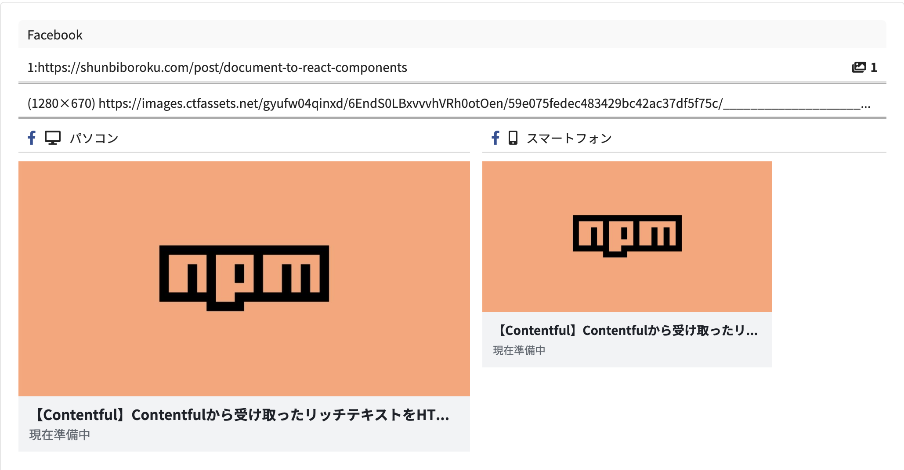

### 背景

本ブログにOGP (Open Graph Protocol)を実装しましたので、その工程を紹介します。

これで、Twitterでシェアしてもいい感じに表示してくれます！

OGPについては下記の記事を[こちら](https://kaikoku.blam.co.jp/client/digimaguild/knowledge/sns-pr/498)をご参照ください。

### 動的ルーティングで実装する必要があった

※動的ルーティングをご存知人は**手順**までスキップして問題ありません。

私はこれまで、記事ページを表示するのに、クエリパラメータを使用していました。

URLでいうと、以下のような感じです。

```
https://shunbiboroku/post?slug=記事のスラッグ
```

これだと記事毎の静的ページは生成されません。せっかくのSSGが台無しな上、SNSでシェアしても、Contentfulから取得したデータ(タイトルやサムネイル)は取得できずじまいでした。

そこで、動的ルーティングにて記事ページを実装したところ、Ogpでうまく表示されるようになりました。

動的ルーディングで実装したURLは以下のようなイメージです。

```
https://shunbiboroku/post/記事のスラッグ
```

この動的ルーティング化については、別記事で紹介できればと思います。

動的ルーティングに関するリファレンスは[こちら](https://nextjs.org/docs/routing/dynamic-routes)

### 手順

ここから、OGP実装までの手順を紹介します。

#### OGP用のコンポーネントを用意

```
//components/Ogp.js

import Head from 'next/head'
function Ogp({ title, description, image, type, path }) {
  const url = '<https://shunbiboroku.com>' + path
  const siteName = 'Shun Bibo Roku'
  const twitterSite = '@kabosu_en'
  const twitterCard = 'summary_large_image'

  return (
    <Head>
      <title>{title}</title>
      <meta property="og:title" content={title} />
      <meta property="og:description" content={description} />
      <meta property="og:type" content={type} />
      <meta property="og:url" content={url} />
      <meta property="og:image" content={image} />
      <meta property="og:site_name" content={siteName} />
      <meta name="twitter:card" content={twitterCard} />
      <meta name="twitter:site" content={twitterSite} />
      <meta name="twitter:url" content={url} />
      <meta name="twitter:title" content={title} />
      <meta name="twitter:description" content={description} />
      <meta name="twitter:image" content={image} />
    </Head>
  )
}
export default Ogp;
```

こちらのOgpコンポーネントを記事ページ(\[slug\].js)に追加します。

なお、関係ない部分に関しては省略しています。

```
// page/post/[slug].js

import { fetchAllPostsWithSlug, fetchPostBySlug } from '../../lib/contentful/contentful'
// 省略

const Post = (props) => {
  return (
    <>
      {"fields" in props.post
        ? <Ogp 
          title={props.post.fields.title + "| Shun Bibo Roku"}
          description={description || ""}
          image={props.image}
          type="article"
          path={props.path}
        />
      : null}
      // 省略
    </>
  )
}

export const getStaticProps = async ({ params }) => {
  const post = await fetchPostBySlug(params.slug) //Contentfulから記事情報取得
  const image = "https:" + post.fields.thumbnail.fields.file.url
  const path = "/post/" + params.slug
  const description = parsePlainTextForDescription(post.fields.body) //リッチテキストからdescription用の文字列を自動生成

  return {
    props: {
      post,
      image,
      path,
      slug: params.slug
    },
  }
}

export async function getStaticPaths() {
  const slugs = await fetchAllPostsWithSlug()　//[{slug: slug1}, {slug: slug2}, ...]
  const paths = slugs.map(slug => ({
    params: slug,
  }))
  console.log(paths);
  return {paths, fallback: false}
}

export default Post
```

Ogpが設定されているか、確認します。

今回は[OGP確認](https://rakko.tools/tools/9/)というサイトを利用させていただきました。ありがとうございます。

URLをセットしてみると、



問題なく表示されているのを確認できました！万歳！
