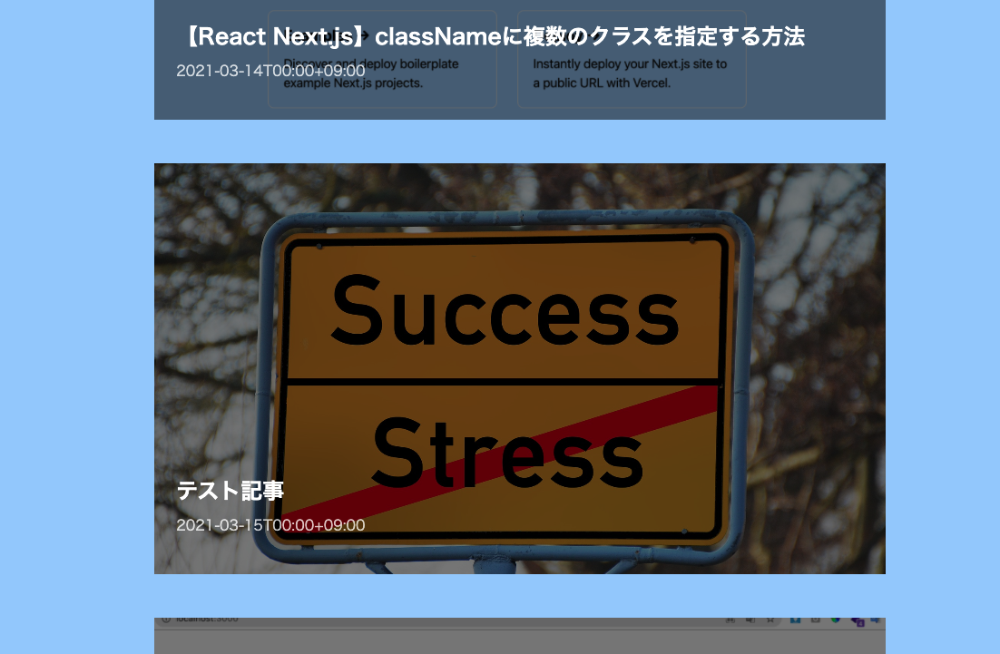
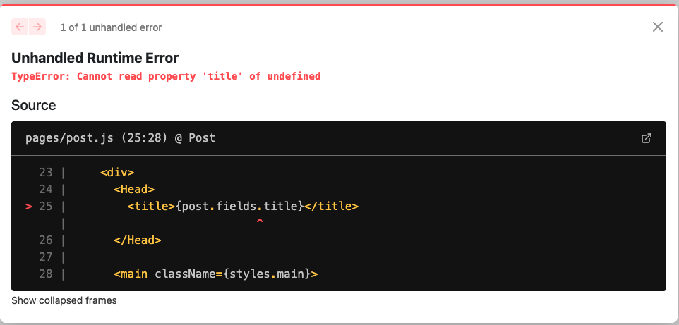

### 背景

Next.js+Contentfulで記事一覧ページが作成できました。みてくれは微妙ですが…。



次に記事単体ページを用意することにしました。

### 問題

一覧ページと同様に

1. Contentfulから記事データ取得
2. 取得したデータをpostというstateに持たせる
3. return内でpostを利用する

という流れでテータを処理を書きました。

```
import Head from 'next/head'
import { useRouter } from 'next/router';
import styles from '../styles/Home.module.css'
import PostContent from '../components/postContent'
import { useEffect, useState } from 'react'
import { getPostBySlug } from '../lib/contentful/contentful';
export default function Post() {
  const router = useRouter()
  const [post, setPost] = useState({})
  const [slug, setSlug] = useState(router.query.slug)
  useEffect(() => {
    async function getPost() {
      const postData = await getPostBySlug(slug)
      setPost(postData)
      console.log(post)
    }
    getPost()
  }, [router])
  return (
    <div>
      <Head>
        <title>{post.fields.title}</title>
      </Head>
      <main className={styles.main}>
        <PostContent
          title={post.fields.title}
          thumbnail={post.fields.thumbnail}
          body={post.fields.body}
          publishedAt={post.fields.publishedAt}
          updatedAt={post.fields.updatedAt}
          slug={post.fields.slug}
        />
      </main>
    </div>
  )
}
```

しかし、以下のようなエラーが出ました。

```
Unhandled Runtime Error
TypeError: Cannot read property 'title' of undefined
```



### 原因: 非同期で記事データを取得する前にコンポーネント内でオブジェクトを表示させようとしている

上記コードの通り、getPostはasyncが指定されているため、記事を非同期で取得しようとしています。

postステートに記事データが入る前に、post内のプロパティをレンダリングしようとしています。これでは当然エラーが出ます。

記事データを取得まで、postを参照させないようにする必要があります。

### 解決策: ステート存在チェックさせる

Contentful取得した記事データは必ず"fields"プロパティを保持しています。

そのため「fields」プロパティが存在しなければ、postを参照させないようハンドリングしました。よくみたら、Vercelが出してるガイドで使用してましたね。私もこれ参考にしたはずなのに…コードちゃんと読みます。

```
<main className={styles.main}>
  {"fields" in post
     ? <PostContent
          title={post.fields.title}
          thumbnail={post.fields.thumbnail}
          body={post.fields.body}
          publishedAt={post.fields.publishedAt}
          updatedAt={post.fields.updatedAt}
          slug={post.fields.slug}
       />
     : null
  }
</main>
```

### 最後に

この記事を書いている時点ではまだ開発環境でNext.jsをおさわりしている状態です。

CSSをどういう構成にするかなど、考えることが山積みなので、公開前から記事を書くことでしっかり考えをまとめてようと思います。

公開した時、記事のボリュームも出ますしね！

お疲れ様でした。
