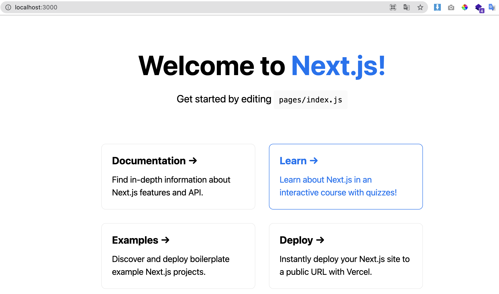

### 本記事の趣旨

Next.jsを用いたブログの開発手順を紹介します。

記事投稿は[Contentful](https://www.contentful.com/)というCMSを利用します。

#### 筆者の前提知識

- 普段はVue.jsを用いて開発している
- JavaScriptの基本知識はある
- Reactはチュートリアル触っただけ

#### 成果物

Docker Composeを用いた開発環境のGitリポジトリ

https://github.com/shun0918/docker-nextjs

### ブログを作ろうと思ったきっかけ

現職では、Vue.jsを用いた開発を行っていますが、比較のためにもReactに触れてみました。

初めに[チュートリアル](https://ja.reactjs.org/tutorial/tutorial.html)に触れてみたところ、「なんとなくReactの方がVueより好きかも…」と感じたので、何か作ってみることにしました。

色々考えたのですが、「ありがちだけどログを作ってみよう」という結果に至りました。

### 手順

#### Docker環境の構築

以下のコマンドをリポジトリをClone

```
git clone https://github.com/shun0918/docker-nextjs
```

.envファイルを、レポジトリのルート配下に作成(「blog-nextjs」は任意の名前に変更)

```
echo "NEXTJS_APP_NAME=blog-nextjs" > .env
```

#### プロジェクト作成

docker-nextjsないで以下のコマンドを実行

※「**blog-nextjs」**部分は、「**Docker環境の構築**」で設定した名前を使用すること。

```
docker-compose run nodejs npx create-next-app blog-nextjs
```

これでapp配下に「blog-nextjs」のプロジェクトが作成されます。

#### コンテナ立ち上げ

以下コマンドで、コンテナを立ち上げます。

```
docker-compose up
```

立ち上がったら、[http://localhost:3000](http://localhost:3000)にアクセスしてみましょう。

「Welcome to Next.js!」が表示されればOKです。



これで構築は完了です。

#### コンテナの管理について

コンテナの停止は、docker-compose stopで可能です。

また、docker-compose downでコンテナを削除しても構いません。

Next.jsのアプリケーションはDocker ComposeのVolumesで管理しています。

コンテナを削除しても、アプリケーションは残ります。

### 今後の方針

この時点でReactとNext.jsに関する知識はほとんどないので、ここからの学習過程も記事にしていきたいと思います。

React・Next.jsを学習されている方にとって役に立つ記事を書いていきますので、よろしくお願い致します！
