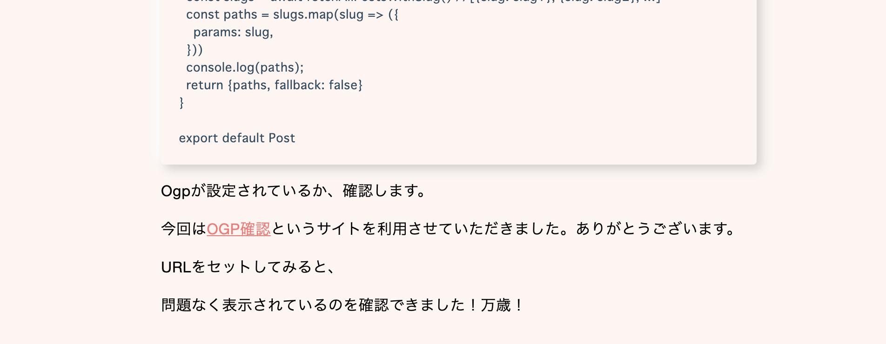
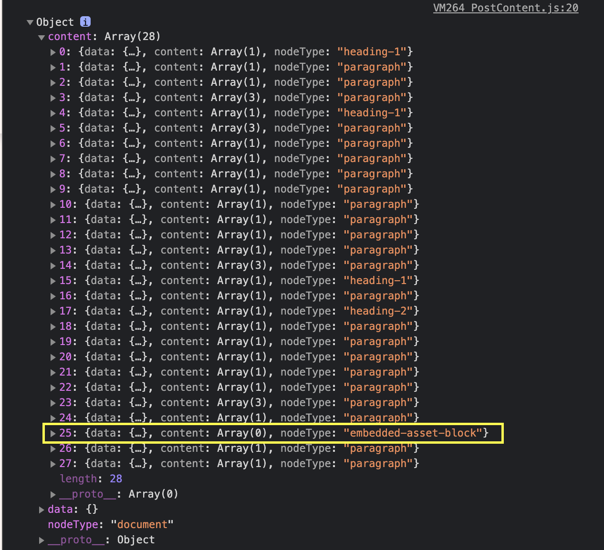
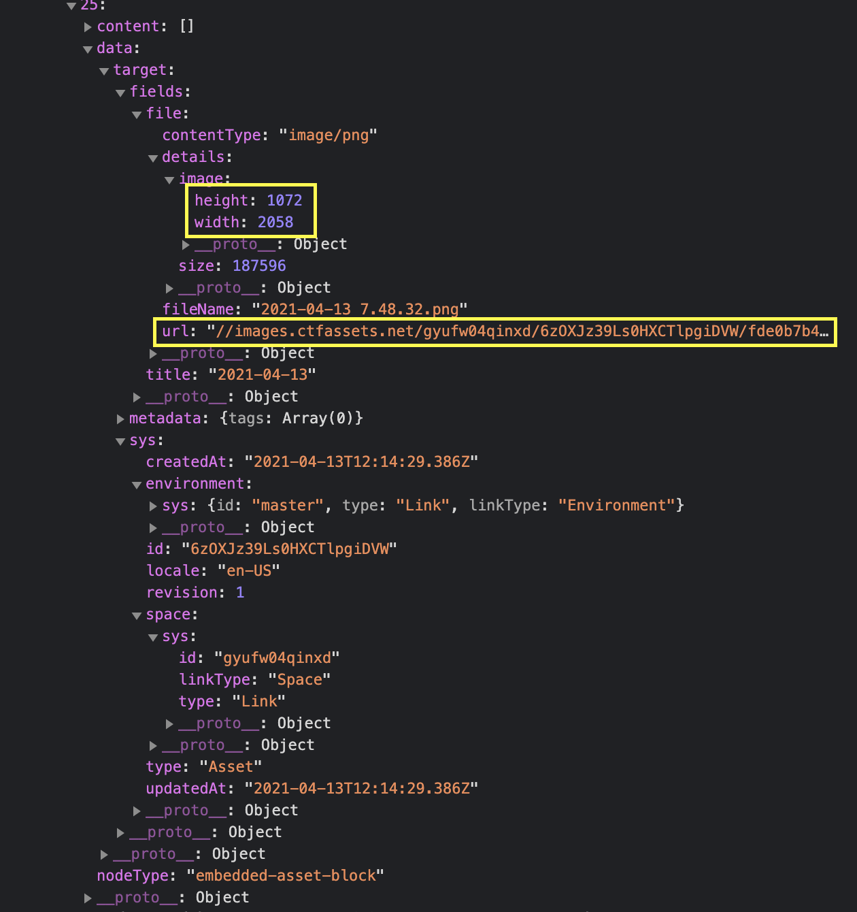

### 背景

本ブログも少しずつ作り込めてはいるのですが、肝心なことを忘れていました。



こちらは[ある記事](https://shunbiboroku.com/post/content-ogp)の一部分なのですが、最後の二行目が異質です。

画面には何も表示されていないのに「URLをセットしてみると」「問題なく表示されました！」と言っています。**問題しかねえよ！**という状態です。

原因を調べてみると、以前導入した[rich-text-react-renderer](https://www.npmjs.com/package/@contentful/rich-text-react-renderer)の設定だけではデフォルトで画像をいい感じに表示してくれないことがわかりました。

**過去記事**

[【Contentful】Contentfulから受け取ったリッチテキストをHTMLに変換する備忘録](https://shunbiboroku.com/post/document-to-react-components)

### rich text内の画像は、「テキストの一部」ではなく、「埋め込み」

見出しにも書いてありますが、rich textで画像を差し込む際、rich text外のコンテンツを画像として埋め込む(embed)という形になります。

それもそのはず、Contentful自体はブログ専用のCMSではありませんし、rich textですから、いくらリッチでも画像は「テキスト」とは言えませんよね。

したがって、この埋め込まれたデータを画像として出力する、つまり**imgタグに変換する**ような処理を書いていきます。

### データの確認

まずは、rich text内に埋め込まれた画像がどのようなデータの形で取得されている確認します。

//body: Contentfulから取得したrichテキスト
console.log(body);



取得したデータの中にある、「**embedded-asset-block**」と記載されているのが画像(Asset)です。

こちらの中身を確認すると



複雑な構造ですが、**url**や**height**の情報など、欲しい情報は揃っていることが確認できます。

今回は**height、width、url**を利用します。

### 実装

前回同様、記事を導入していきます。なお、本記事に関係ない部分は省略しています。

####  @contentful/rich-text-typesを利用してimgタグを生成

```
// lib/contentful/option.js
import { BLOCKS, MARKS } from '@contentful/rich-text-types'
```

```
export const options = {
  renderNode: {
    [BLOCKS.EMBEDDED_ASSET]: (node, children) => {
      const src = "https:" + node.data.target.fields.file.url
      const height = node.data.target.fields.file.details.height
      const width = node.data.target.fields.file.details.width
      return 
    }
  }
}
```

#### 作成したoptionを利用する

この`option`を`rich-text-react-renderer`の`documentToReactComponents`で利用します。

```
// lib/contentful/_documentToReactComponents.js
import { documentToReactComponents } from '@contentful/rich-text-react-renderer'
import { options } from './options'
```

```
export function _documentToReactComponents(body) {
  return documentToReactComponents(body, options);
}
```

これで準備ができました。

#### rich textを変換

こちらを用いてrich textを変換します。私の場合フィールド名はbodyなので、`_documentToReactComponents.js`の引数にbodyを渡します。

```
// pages/post/[slug].js
import { _documentToReactComponents } from '../../lib/contentful/_documentToReactComponents'

const Post = (props) => {
  const body = _documentToReactComponents(props.post.fields.body)
```

```
  return (
    <>
      <main className={styles.main}>
        {"fields" in props.post
          ? <PostContent 
              title={props.post.fields.title}
              thumbnail={props.post.fields.thumbnail}
              body={body}
              publishedAt={props.post.fields.publishedAt}
              updatedAt={props.post.fields.updatedAt}
              slug={props.post.fields.slug}
            />
          : null }
      </main>
    </>
  )
}
```

ちなみにPostComponent.jsはこんな感じです。

```
// components/PostContent.js
import styles from '../styles/components/PostContent.module.scss'
```

```
function PostContent({ title, thumbnail, body, publishedAt, updatedAt, slug }) {
```

```
  return (
    <article className={styles.content}>
      <div className={styles.content__head}>
        <h2 className={styles.content__title}>{ title }</h2>
        <p className={styles.content__date}>投稿日:{" "}{publishedAt}</p>
      </div>
      <div className={styles["content__eyecatch-wrapper"]}>
        
      </div>
      <div className={styles.content__body}>
        { body }
      </div>
    </article>
  )
}
```

```
export default PostContent
```

#### 確認

これで画像が表示されるか確認します。


今度こそ、記事内に画像が盛り込めています！万歳！

### まとめ

今回はrich text内に埋め込まれた画像を表示するための処理を書きました。

なお、本ブログのプロジェクトはGitHubにて公開しておりますので、学習の参考になれば幸いです。

[https://github.com/shun0918/blog-nextjs](https://github.com/shun0918/blog-nextjs)
