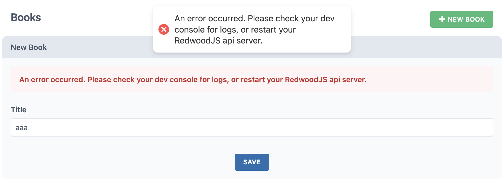
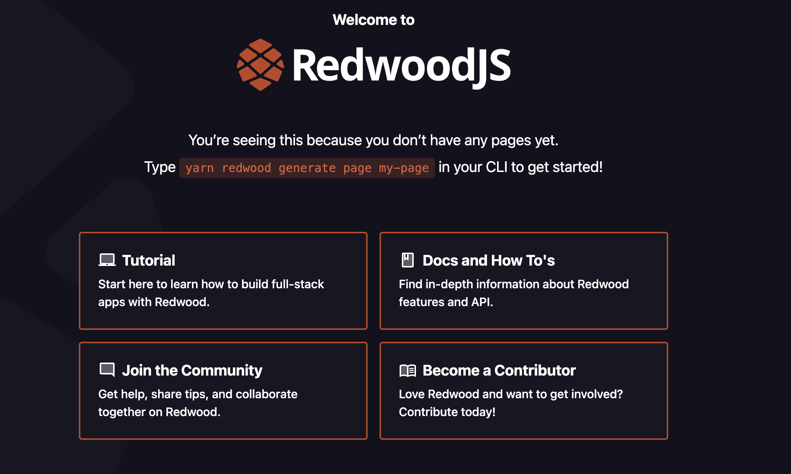

### はじめに

最近名前を見かけるようになったJSのWebフルスタックフレームワークRedwoodJSを触った際、Dockerで開発環境を構築したので共有します。

[RedwoodJS: The App Framework for Startups | RedwoodJS.com](https://redwoodjs.com/)

RedwoodJSに関する説明は割愛します。

### 手順

初めにdocker-compose.ymlを作成します。

```
# docker-compose.yml
version: "3.8"

services:
  app:
    image: node:16.15 # 17未満じゃないと怒られるので注意
    volumes:
      - .:/app
    tty: true
    working_dir: /app
```

> https://redwoodjs.com/docs/quick-start
> Prerequisites
>
> Redwood requires Node.js (\>=14.19.x \<=16.x) and Yarn (\>=1.15)
> Are you on Windows? For best results, follow our Windows development setup guide

NodeJSのバージョンは16.x以下を選択しましょうとのことです。

初めにprojectを作成します。

```
docker-compose run --rm app yarn create redwood-app my-redwood-project --typescript
```

`—typescript`をつけると、プロジェクトがTS化されます。

ちなみに、Node.jsのバージョンを18.2でやってみると「バージョン違う、ドキュメント読めや」と怒られます。

```
Error: node >=14.19.0 <17.0.0 required, but you have 18.2.0

Visit requirements documentation:
/docs/tutorial/chapter1/prerequisites/#nodejs-and-yarn-versions
```

無事インストールされるとこんな感じのログが出ます。

```
Thanks for trying out Redwood!

 ⚡️ Get up and running fast with this Quick Start guide: <https://redwoodjs.com/docs/quick-start>

Join the Community

 ❖ Join our Forums: <https://community.redwoodjs.com>
 ❖ Join our Chat: <https://discord.gg/redwoodjs>

Get some help

 ❖ Get started with the Tutorial: <https://redwoodjs.com/docs/tutorial>
 ❖ Read the Documentation: <https://redwoodjs.com/docs>

Stay updated

 ❖ Sign up for our Newsletter: <https://www.redwoodjs.com/newsletter>
 ❖ Follow us on Twitter: <https://twitter.com/redwoodjs>

Become a Contributor ❤

 ❖ Learn how to get started: <https://redwoodjs.com/docs/contributing>
 ❖ Find a Good First Issue: <https://redwoodjs.com/good-first-issue>

Fire it up! 🚀

 > cd my-redwood-project
 > yarn rw dev
```

この時点で、`my-redwood-project`というディレクトリができあがっているはずです。

あとは、ログの末尾に書いてある通りプロジェクトのrootでdevサーバを起動します。

が、その前に開発サーバーのportを開けたり、Docker環境のサーバにアクセスするには、hostを0.0.0.0に設定してホストOSからlocalhostでアクセスできるようにする必要があります。

```
# my-redwood-project/redwood.toml
# ...略
[web]
  title = "Redwood App"
  port = 8910
  host = '0.0.0.0' # 追加
[api]
  port = 8911
# ...略
```

また、.envに以下を追加します

```
RWJS_DEV_API_URL=http://localhost
```

これを入れないとAPIにリクエストを送る際、以下のようなエラーが発生します



Server側のconsoleを見てみると以下のようなエラーがありました。

web | \<e\> \[webpack-dev-server\] \[HPM\] Error occurred while proxying request localhost:8910/graphql to http://\[::1\]:8911/ \[EADDRNOTAVAIL\] (https://nodejs.org/api/errors.html#errors\_common\_system\_errors)

注目ポイントはproxying request localhost:8910/graphql to http://\[::1\]:8911/という部分で、プロキシ先がlocalhostではなく、\[::1\]になってしまっています。

これはhost='0.0.0.0'を設定したことで、IPv6ではループバックアドレスがプロキシ先に選択されてしまいます(なぜipv6になるのかはわからず…)。

そのため、.envファイルでDevサーバのproxy先を明示的にlocalhostにしてあげます。

また、redwood.tomlをみる限り、フロントが8910, APIが8911のポートで公開されるみたいなので、`docker-compose.yml`を反映させていきます。

ついでに、volume周りの調整も済ましましょう。

```
version: "3.8"

services:
  app:
    image: node:16.15 # 17未満じゃないと怒られるので注意
    ports:
      - 8910:8910 # フロントエンドのPort
      - 8911:8911 # APIのPort
    volumes:
      - ./my-redwood-project:/app
      - node_modules:/app/node_modules #volume trick
    tty: true
    working_dir: /app
    command: sh -c "yarn install && yarn rw dev"

volumes:
  node_modules:
    driver: local
```

node\_modulesをvolumeに含めるとパフォーマンスが下がるので、volume trickというテクニックを使って解決しています。

[【JavaScript】Docker上でのnpm/yarnの操作を10倍早くする方法 | ゆとって生きたい。](https://tkkm.tokyo/post-495/)

その代わりnode\_modulesはコンテナ側から同期されなくなってしまいます。VSCodeでnode\_modulesを参照したい場合などはローカルでyarn installするか[Remote Container](https://code.visualstudio.com/docs/remote/containers)などを使用されることをお勧めします。

command部分は、毎度container起動時にサーバが立ち上がるようにしています。

あとはdocker-compose upして起動します。

```
docker-compose up
```



[http://localhost:8910](http://localhost:8910) にアクセスしてみて、上記のようなページにアクセスされれば成功です。

### 感想

ESLint、Prettierはもちろん、Jest, Typescript, Storybook、VSCodeのextensionまではいってて、この辺りの面倒な初期設定を省けるのは本当に楽です。

個人開発で何か作りたくなったら真っ先にこのRedwoodJSを考えるんじゃないかなと思います(もちろん作るもの次第ですが…)。

いろいろいじってみてまた問題にぶつかったら記事にしようと思います〜
