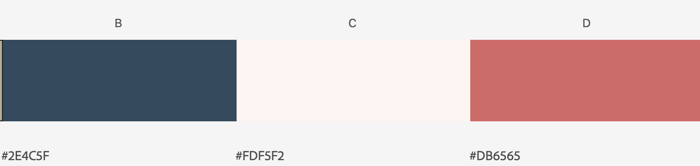
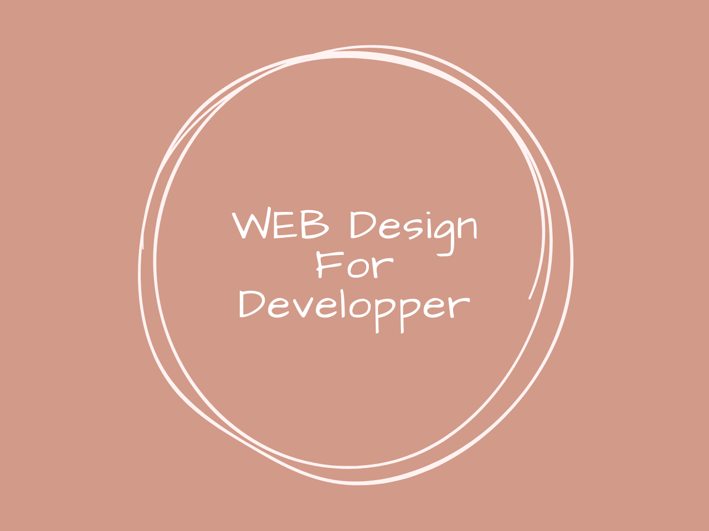

### 背景

本ブログを作るにあたり、「デザインもイケてるやつにしたいな〜」と考えていました。

それと同時に、「どうせならありきたりではなく、オリジナリティがある感じがいいな〜」と感じ、デザインを自作することにしました。

私は、会社ではフロントエンドの開発がメインで、デザイナーが社内にいない時はAdobe XDを使ってモックを作成していていました。

その際、イケてない感じが感じがしたので、「今回こそは！！」と意気込んで、本ブログのデザインに取り掛かりました。

### デザインの流れ

デザインをするまで、以下の手順で進めました。

1. 書籍を使って基本をインプット
2. サイトのコンセプトを決定
3. サイトに使用する色を他サイトから抽出
4. 使用するフォントの選定
5. モデルを決めて、真似しながらオリジナリティを加える

また、以下を意識して作業を進めました。

1. **ベースは自分で作ろうとしない。**まねてから、オリジナリティを加える。
2. 余白を怖がらない。やたらと線で囲わない。
3. コントラストを中途半端にしない。大胆に行う。

#### 

#### 1. 書籍を使って基本をインプット

「早速デザインするぞ！」と思ったのですが、最低限デザインに関する知識を抑えたかったので、「[ノンデザイナーズ・デザインブック](https://amazon.co.jp/ノンデザイナーズ・デザインブック-第4版-Robin-Williams/dp/4839955557)」を読むことにしました。

ここで、デザインの基本原則「近接」「整列」「反復」「コントラスト」を抑えました。

ここでは簡単にご紹介します。

- 近接：
関連する項目は近くに寄せてグループ化する。
- 整列：
基準線(ベースライン)をつくる。活字が左寄せなら、開始位置を揃える等。
- 反復：
デザイン上の特徴を繰り返す。繰り返すことで、一貫性を生み出す。
- コントラスト：
コントラストをつけて、ユーザの目をひきこむ。コントラストは恐れず大胆にやる。

近接・整列あたりは以前から知っていたのですが、コントラストが非常に参考になりました。以前の自分は、**0.1emという誤差レベル**でコントラストをつけたつもりになっていましたので…。

#### 2. サイトのコンセプトを決定

次に、「どんなサイトにするか」を大まかに決めました。

私の場合はこんな感じです。

- ブログなので「読みやすいさ」が最優先。
- その上で、デザイン上でこだわりを見せる。
- トレンディーなデザインを取り入れてみる。

これを抑えた上で、こんな方針になりました。

- 「読みやすさ」確保のため、うっとおしくない配色にする。
- 同様に、記事ページはシンプルにする。
- トレンド？の「ニューモーフィズム」にトライしてみる。

これで大枠は決まりました。

ニューモーフィズムについて知りたい方は下記をご参照ください。

[ニューモーフィズムとは？デザイン方法やルールのまとめ](https://webdesign-trends.net/entry/11155)

#### 3. サイトに使用する色を他サイトから抽出

次に、サイトに使用する色を選定しました。

ここでも条件付けをします。条件付けすることで選択肢を減らし、選定を楽にします。

条件として、「背景は白に近い色」としました。理由は二点あります。

一つ目は、可読性を考慮するためです。

2つ目は、ニューモーフィズムと暗い背景は相性が悪いことです。**ダークテーマ**のような背景にすると、影が見づらくなり、凸凹がわかりづらくなります。

ただ白でも面白みがないかなと感じたので、「白に近い色」という選定をしました。

これを下に、参考サイトを探しました。検索には[Pintarest](https://www.pinterest.jp/)を利用しました。



実際に参考にしたサイトはご紹介しませんが、そのサイトから本サイトにも使われている「肌色っぽい白」「紺色」「ピンクっぽい赤」拝借しました。筆者の呼び方はダサいですが、色自体は非常に気に入っております。

#### 4. 使用するフォントの選定

「ノンデザイナーズ・デザインブック」ではフォント選びも**コントラスト**に大きく関わっているという旨が記載されていました。しかし、もともと海外の書籍のため、日本語のテキストではあまり参考にはなりませんでした。

そのため、下記記事を参考にfontを設定しました。[ics.media](https://ics.media/)さんいつもお世話になっております。ありがとうございます。

https://ics.media/entry/200317

```
body {
  font-family: "Helvetica Neue",
    Arial,
    "Hiragino Kaku Gothic ProN",
    "Hiragino Sans",
    Meiryo,
    sans-serif;
}
```

また、サイトのロゴは「[Damion](https://fonts.google.com/specimen/Damion?query=damion#standard-styles)」というWebフォントを使うことにしました。

可愛い感じの配色なので、ロゴも可愛い感じにしました。

また、**コントラストは恐れず大胆に!**というスタンスで、普段使わない`text-shadow`もつけました。



#### 5. モデルを決めて、真似しながらオリジナリティを加える

機能を実装する際、1からコードを書くより、GitHubや記事のコードをコピペして、そこから修正を加えるほうが早いですよね(コードの意図は理解しなければいけませんが)。

デザインも同様です。ましてや私のような非デザイナーが1から作ったら、大惨事です。

また、今回作成するのはブログなので、特別なUIは不要です。むしろ、気を衒わないことで、ユーザにとって使い慣れたUIを実装できます。

**でも、オリジナリティも加えたい…**

ということで、巷で流行っている？「ニューモーフィズム」を本サイトにも取り入れることにしました。

[Neumorphism UI](https://demo.themesberg.com/neumorphism-ui/index.html)というモジュールも見つけたのですが、今回は採用を見送りました。ニューモーフィズム自体触れるのが初めてで、本当に使えるかどうか判断できかねたためです。

ということで、「レイアウト」は他のブログを参考にさせていただき、それをニューモーフィズムで実装することとしました。

### まとめ

もっと良いデザイン作成の手順は他にたくさんあるかと思いますが、私はこのように進めました。

今回の学びは「基礎はインプットしておくべき」ということです。普段は、「とりあえずやってみろ」の精神で進めていますが、デザイン4原則を抑えていなければ、「なぜそのデザインの悪いのか」を理解できなかったかと思われます。

デザインそのものは定量できないので、「判断基準という教養」はインプットが必要だと思った次第です。

また、本記事は実際にサイトのデザインをしながら書いているので、校正がメチャメチャになって読みづらいかったかと思われます。記事の書く手順、タイミングも教養として抑えたいところです。
